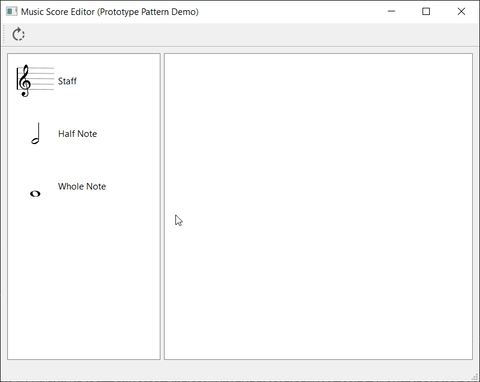
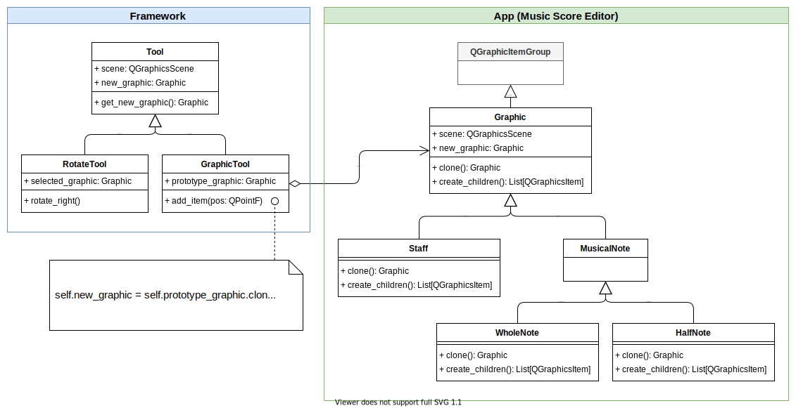
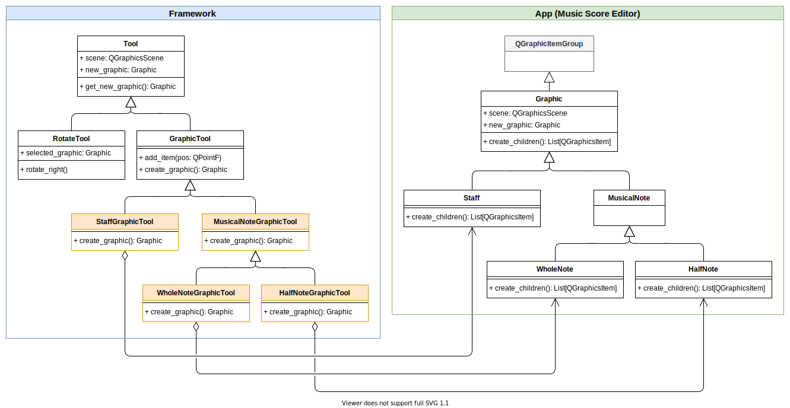
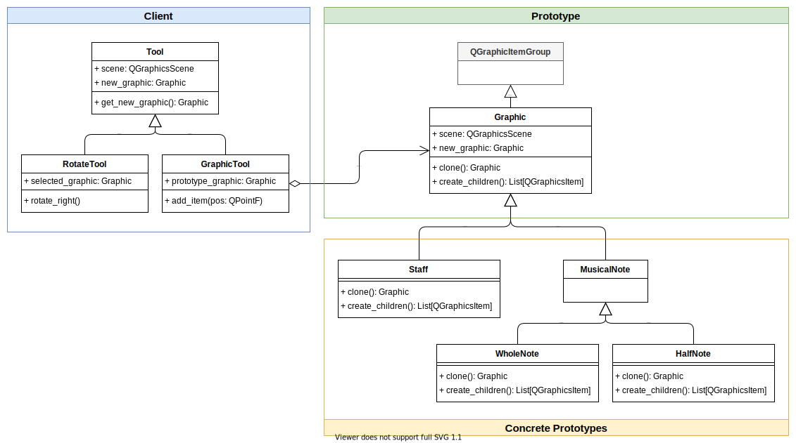

# Music Score Editor (Prototype Pattern Demo)



A PySide2 implementation of the prototype pattern example in the book
[Design Patterns: Elements of Reusable Object-Oriented Software](https://books.google.com.tw/books?id=6oHuKQe3TjQC).

The book only mentioned the music scores editor in the Motivation section but
latter showed the sample code with maze one. I thought it would be great if
there are sample code with music scores editor. So here it is my attempt at
trying to show the advantages of prototype pattern the book claims.

## Using Prototype Pattern vs Not Using It

With prototype pattern:



Without prototype pattern we may introduce lots of parallel subclasses (orange)
under GraphicTool:



I've also written a file
[src/framework/tool_without_prototype.py](src/framework/tool_without_prototype.py)
that demonstrates the consequences of not using the prototype pattern.

To use
[src/framework/tool_without_prototype.py](src/framework/tool_without_prototype.py),
simply comment and uncomment the import lines in
[src/views/my_graphics_view.py](src/views/my_graphics_view.py).

## Pro: Reusable Framework

We can reuse the framework in other applications. For example, we can create
another application that renders in-game level editor:


We can reuse the framework in other applications too as long as they provide the
`clone` methods telling the framework how to copy the objects so that the
framework can put them on the canvas.

## Pro: Faster Objects Creation

You might ask why not just create new objects and pass the ownership to
`GraphicTool`? We can still reuse the framework.
[What's the point](https://stackoverflow.com/questions/13887704/whats-the-point-of-the-prototype-design-pattern)
of the prototype pattern?

Another appropriate scenario for choosing prototype pattern over simply creating
new objects is when the cloning process is potentially faster than creating the
objects (e.g., shallow copying, copy-on-write), or when the objects can't be
created again (e.g., objects created with data received from the network).

In this project, when a prototype `QGraphicsItemGroup` is first created, it uses
`QSvgRenderer` to parse the SVG files. The parsing process may be expensive if
there are lots of SVG files or when some SVG files are big.

Later when a `QGraphicsItemGroup` is cloned, it simply reuses the `QSvgRenderer`
to skip re-parsing the SVG files. This can be observed in the `qDebug` messages
by seeing that `QSvgRenderer` with the same filename is only created once when
you drag and drop a musical note the first time. See `reuse_svg_renderers` and
`find_or_create_svg_item` in [src/app/graphics.py](src/app/graphic.py) for
related code.

## Structure

There are 3 types of basic components in prototype pattern:



## Additional Features

- Can drag and drop items from the toolkit to the canvas
- The whole note and half note will snap to the lines of the nearest staff
- Can rotate each musical note
- You can't move musical notes outside the canvas

## Implementation

- A `QGraphicsView` holds a `QGraphicsScene`
- The `QGraphicsScene` holds many `QGraphicsItemGroup`
- `QGraphicsItemGroup` holds one or many subclasses of `QGraphicsItem`
  (e.g., `QGraphicsSvgItem` and `QGraphicsLineItem`)
- The `QGraphicsSvgItem` in the cloned `QGraphicsItemGroup` share the same
  `QSvgRenderer` with the `QGraphicsSvgItem` in the old `QGraphicsItemGroup`

## Install

### Prerequisites (Install)

- Miniconda (or Anaconda)
- PySide2 requires Python 3.5+

### Steps

The installation process should be the same for both Windows and Linux.

1. Create a conda environment `pyside2`

   ```bash
   conda create --name pyside2 python=3.9
   ```

   NOTE: You can also use other Python versions as long as PySide2 supports it

2. Activate the `pyside` env

   ```bash
   conda activate pyside2
   ```

3. Install the project

   ```bash
   pip install -e .
   ```

## Run

### Prerequisites (Run)

1. Activate the `pyside` env

   ```bash
   conda activate pyside2
   ```

2. Generate Python files from `.ui` files (only after you have modified `.ui`
   files)

   ```bash
   pyside2-uic -o src/ui/mainwindow.py src/ui/mainwindow.ui
   ```

3. Generate Python files from `.qrc` files (only after you have modified `.qrc`
   files)

   ```bash
   pyside2-rcc -o src/resources_rc.py src/resources.qrc
   ```

### Run Main GUI

1. Activate the `pyside` env

   ```bash
   conda activate pyside2
   ```

2. Run `main.py`

   ```bash
   python src/main.py
   ```

## Editing Files in Qt Creator

Open the project file `music-score-editor-prototype-demo.pyproject` in Qt Creator. Then you can edit the following files with the GUI tools in Qt Creator:

- `src/ui/mainwindow.ui`
- `src/resources.qrc`

## Tools Used for Creating This Project

These tools are all free and open-source:

- [Visual Studio Code](https://code.visualstudio.com/): editing source code and
  running GUI
- [Qt Creator](https://www.qt.io/product/development-tools): editing `.ui` and
  `.qrc` files
- [Miniconda](https://conda.io/miniconda.html): providing Python environment
- [Inkscape](https://inkscape.org/): editing `.svg` files
- [diagrams.net Desktop](https://chrome.google.com/webstore/detail/diagramsnet-desktop/pebppomjfocnoigkeepgbmcifnnlndla):
  creating diagrams
